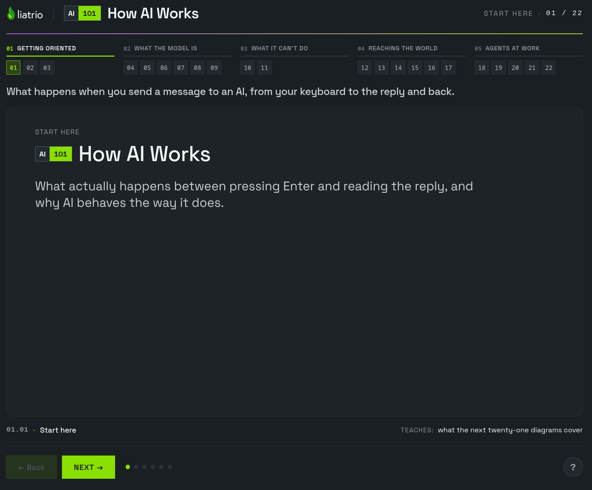

# AI 101: How AI Works

**A visual, self-paced introduction to what happens between sending a message to an AI and reading its reply.** Liatrio built this course for anyone curious about AI—whether you're exploring it for yourself, using it at work, or helping a team use it well. Allow **45–60 minutes** to explore it.

[Start the course →](https://ai-101-course.lab.liatr.io/) · [Suggest an improvement](https://github.com/liatrio-labs/ai-101-course/issues) · [Latest release](https://github.com/liatrio-labs/ai-101-course/releases/latest)

[](https://ai-101-course.lab.liatr.io/)

## What you'll learn

The course demystifies prompts and responses without requiring a technical background. Its five acts build a grounded mental model of:

1. **Getting oriented** — the course map and essential terms.
2. **What the model is** — messages, tokens, and context windows.
3. **What it cannot do on its own** — prediction, hallucinations, and limits of recall.
4. **Reaching the world** — harnesses, tools, documents, skills, and plugins.
5. **Agents at work** — loops, sub-agents, durable artifacts, and human choices.

Each lesson reveals its diagrams step by step. Use **Next** and **Back** (or the right and left arrow keys), select an act or lesson from the navigation, and open **Help** for the course guide.

### Referencing a slide

Use its **section.slide** number, shown at the bottom left of the course, when discussing content or reporting an issue—for example, `01.03`, `07.04`, or `12.02`. The first two digits identify the section; the final two identify the slide within it.

## Progress and completion

Progress stays in your browser's `localStorage` on that device. It is not synced across browsers or devices and disappears if you clear site data or use private browsing. **Reset Progress & Restart** clears your position, name, and completion record.

At the end, you can optionally add a name to a personal completion record and use **Print / save as PDF** to keep a copy. Its ID and timestamp are created in your browser; it is not an independently verified or Liatrio-issued credential.

## Run locally

This static site needs no build step or package installation for local preview. From the repository root, serve it with any static HTTP server; for example:

```sh
python3 -m http.server 8090 --bind 127.0.0.1
```

Open [http://127.0.0.1:8090/ai-101-course.html](http://127.0.0.1:8090/ai-101-course.html). The hosted container serves the same `ai-101-course.html` as `/`.

## Contributing and releases

Found an unclear explanation or a bug? [Open an issue](https://github.com/liatrio-labs/ai-101-course/issues) and include the **section.slide** number when relevant. Before changing course behavior, note that `support.js` is generated runtime code and should not be edited directly; learner state lives in `course-state.js` and browser `localStorage`.

Install [pre-commit](https://pre-commit.com/) (for example, `pipx install pre-commit`) and enable both hook stages:

```sh
pre-commit install --hook-type pre-commit --hook-type commit-msg
pre-commit run --all-files
node --test tests/course-state.test.mjs
node --test tests/course-template.test.mjs
node --check course-state.js
node --check support.js
git diff --check
```

The hooks cover file hygiene, secrets, maintained Markdown, Conventional Commits, and fast course checks. Review and restage any formatter changes. CI runs the same checks on pull requests even if local hooks are absent. Releases follow Conventional Commits: see the [changelog](CHANGELOG.md) and [GitHub Releases](https://github.com/liatrio-labs/ai-101-course/releases).

## Source availability and reuse

The source may be visible on GitHub, but visibility is not a grant of reuse rights. Liatrio does not provide a general reuse license for its authored source, teaching material, design-system material, or marks. If you want to suggest a correction or improvement, [open an issue](https://github.com/liatrio-labs/ai-101-course/issues) rather than assuming outside code contributions are accepted.

The bundled Space Grotesk font is licensed separately under the SIL Open Font License 1.1; see its [font-specific license notice](_ds/liatrio-design-system-019dd485-a9ab-7b37-9403-944d981aaea9/fonts/OFL.txt). This font license does not apply to Liatrio-authored materials.
